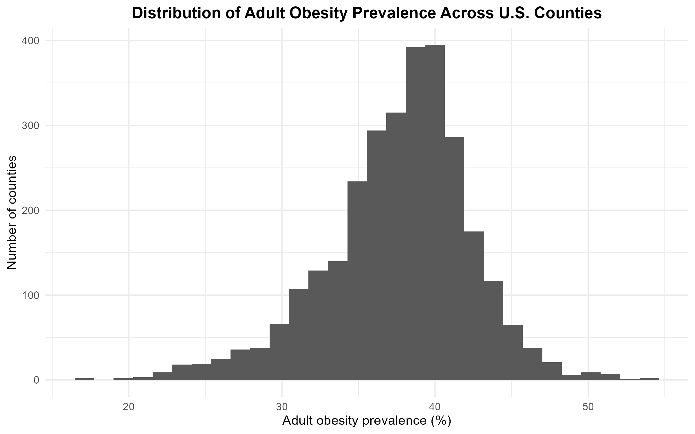
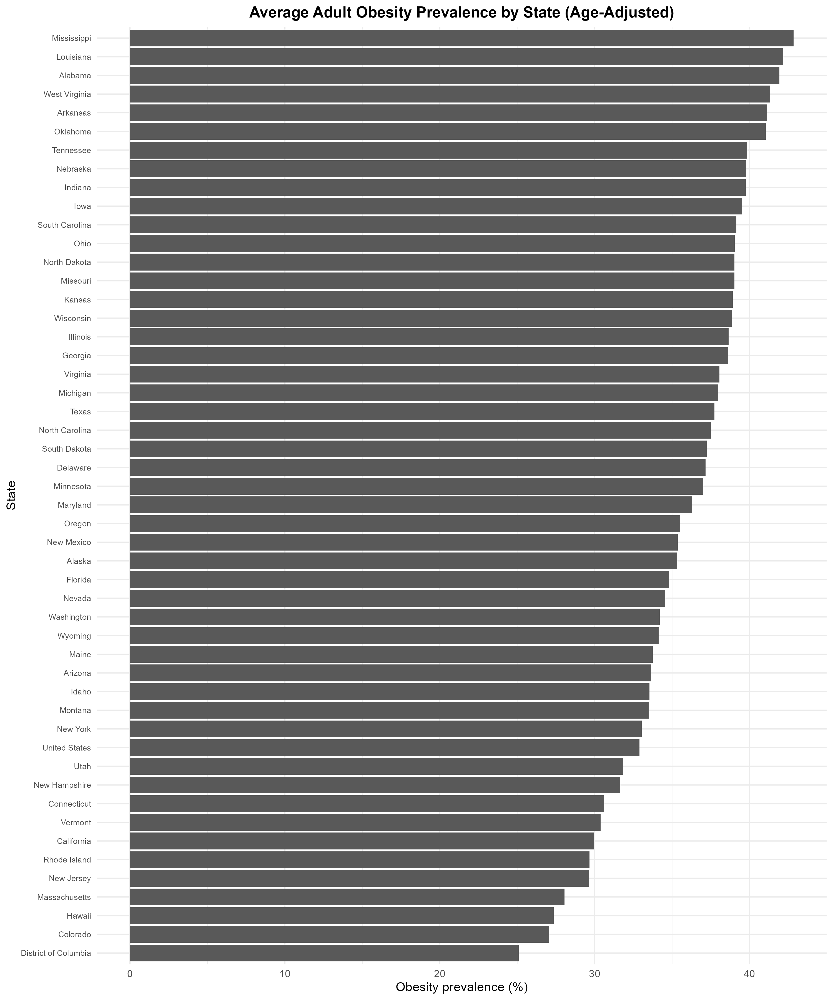
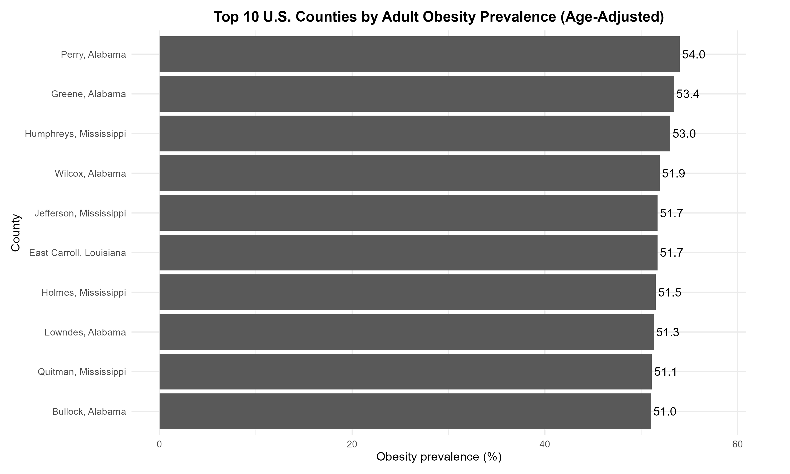

# U.S. Adult Obesity Analysis (CDC PLACES)

Analysis of U.S. adult obesity prevalence using CDC county-level data in R.

## Objective

The goal of this project was to analyze how adult obesity prevalence varies across U.S. counties and states, and to identify regions with the highest burden of obesity.

## Tools Used

- R
- dplyr
- ggplot2

## Data

This project uses the CDC PLACES county-level dataset. The analysis focuses on age-adjusted adult obesity prevalence for the year 2023.

## Methods

- Filtered the dataset to include only adult obesity prevalence, age-adjusted values, and the year 2023  
- Removed duplicate county entries to ensure one observation per county  
- Aggregated data at the state level using mean obesity prevalence  
- Identified counties with the highest obesity prevalence  
- Created visualizations using ggplot2 to explore patterns  

## Key Findings

- The average adult obesity prevalence across U.S. counties was approximately 37.6%  
- Southern states had the highest average obesity prevalence  
- Mississippi, Louisiana, and Alabama ranked among the highest states  
- The top 10 highest-obesity counties were highly concentrated in Alabama and Mississippi  

## Visualizations

### Distribution of Obesity Across Counties

### Average Obesity by State

### Top 10 Counties by Obesity Prevalence

## Limitations

This analysis is descriptive and does not establish causation. Differences in obesity prevalence may be influenced by factors such as physical activity, dietary patterns, socioeconomic conditions, healthcare access, and other environmental or social factors.

## Conclusion

Adult obesity prevalence varies across U.S. counties and states, with clear regional clustering in parts of the South. These findings highlight the importance of targeted public health efforts in high-burden areas.
